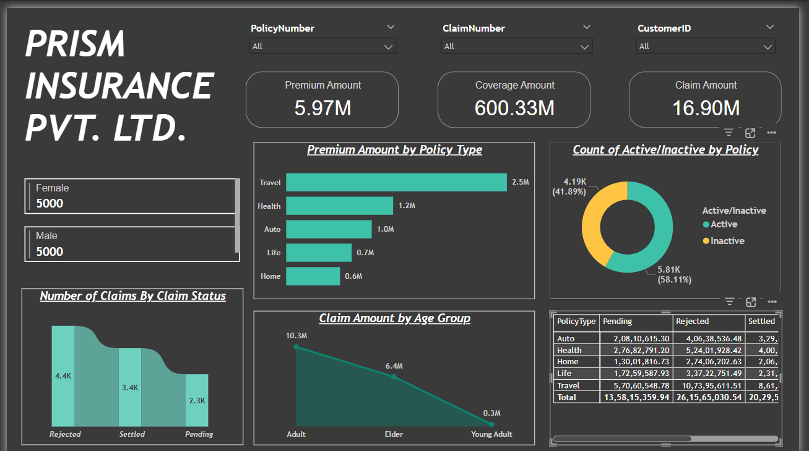

# Insurance Data Analysis - Power BI Dashboard

## Project Overview
This project is an **Insurance Data Analysis Dashboard** built using **Microsoft Power BI**. It provides key insights into various insurance policies, claims, premium amounts, and customer demographics. The dashboard helps in monitoring insurance business performance and analyzing trends related to policy claims, premium distribution, and customer segmentation.

## Features
The Power BI dashboard includes the following key visualizations:

- **Total Premium Amount:** Displays the total premium collected.
- **Total Coverage Amount:** Represents the total insured sum.
- **Total Claim Amount:** Shows the total claims paid out.
- **Premium Amount by Policy Type:** Breaks down premium contributions by insurance type (e.g., Travel, Health, Auto, Life, Home).
- **Number of Claims by Claim Status:** Categorizes claims as Rejected, Settled, or Pending.
- **Claim Amount by Age Group:** Analyzes claim distribution among different age groups (Adult, Elder, Young Adult).
- **Count of Active/Inactive Policies:** Provides insight into policy retention rates.
- **Claims Breakdown by Policy Type:** Displays the count and amount of claims under different categories.
- **Demographics:** Highlights gender-based policyholder statistics.

## Dashboard Preview

## Data Sources
The dataset used in this analysis includes:
- Policyholder demographics
- Insurance policy details
- Claims history
- Premium amounts and coverage

## Business Insights
- Travel insurance contributes the highest premium amount.
- A significant number of claims are rejected compared to settled claims.
- Adults have the highest claim amount, followed by elders and young adults.
- Over **58%** of policies are active, while **42%** are inactive.
- Home insurance has a lower premium collection compared to other policy types.

## Tools & Technologies Used
- **Power BI** for data visualization and interactive dashboards.
- **Data Cleaning & Transformation** performed using Power Query.
- **DAX (Data Analysis Expressions)** for calculated fields and measures.

## How to Use the Dashboard
1. Open the Power BI dashboard file.
2. Use the **filters** to analyze data based on Policy Number, Claim Number, and Customer ID.
3. Hover over the visualizations to view detailed insights.
4. Interact with different charts to explore claim statuses, premium distribution, and customer segmentation.

## Future Enhancements
- Integrating **real-time data** for up-to-date analysis.
- Adding **predictive analytics** for claim forecasting.
- Expanding demographics insights to include regional and age-based trends.

## Conclusion
This Power BI dashboard provides valuable insights into the insurance business, helping stakeholders make data-driven decisions to optimize policy management, improve claim settlement rates, and understand customer behavior effectively.

